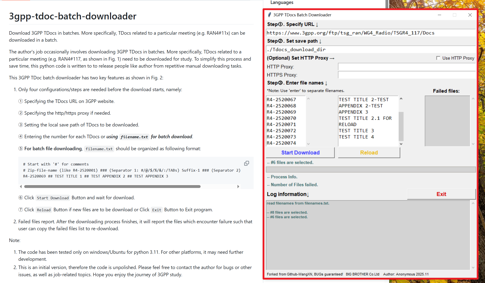
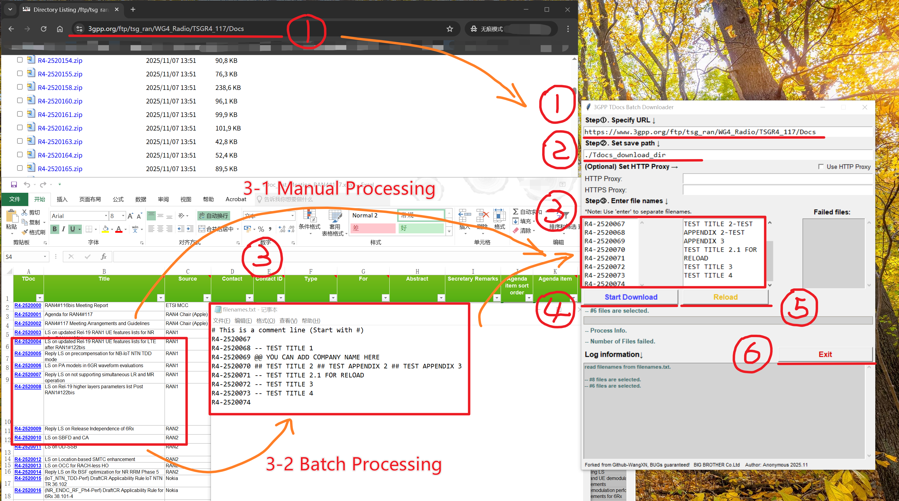

# 3gpp-tdoc-batch-downloader
Download 3GPP TDocs in batches. More specifically, TDocs related to a particular meeting (e.g. RAN4#11x) can be downloaded in a batch. 

The author's job occasionally involves downloading 3GPP TDocs in batches. More specifically, TDocs related to a particular meeting (e.g. RAN4#117, as shown in Fig. 1) need to be downloaded for study. To simplify this process and save time, this python code is written to to release people like author from repetitive manual downloading tasks.

This 3GPP TDoc batch downloader has two key features as shown in Fig. 2:
1.	Only four configurations/steps are needed before the download starts, namely:

    ①   Specifying the TDocs URL on 3GPP website. 

    ②	Specifying the http/https proxy if needed. 

    ③	Setting the local save path of TDocs to be downloaded. 

    ④	Entering the number for each TDocs or ***using ```filename.txt``` for batch download***.

    ⑤    **For batch file downloading**, ```filename.txt``` should be organized as following format:

        # Start with '#' for comments
        # Zip-file-name (like R4-2520001) ### (Separator 1: #/@/$/%/&/:/TABs) Suffix-1 ### (Separator 2) Suffix-2 ### ...
        R4-2520069 ## TEST TITLE 1 ## TEST APPENDIX 2 ## TEST APPENDIX 3

    ⑥   Click ```Start Download``` Button and wait for download.

    ⑦   Click ```Reload``` Button if new files are to be download or Click ```Exit``` Button to Exit program.
        


2.	Failed files report. After the downloading process finishes, it will report the files which encounter failure such that user can copy the failed files list to re-download.

Note: 
1.	The code has been tested only on windows/Ubuntu for python 3.11. For other platforms, it may need further development.
2.	This is an initial version, therefore the code is unpolished. Please feel free to contact the author for bugs or other issues, as well as job-related topics. Hope you enjoy the journey of 3GPP study.

Author Information：Xiaonan (wangxn_007@163.com) currently working at Baicells
                    Reformatsky (do not disclosed)



